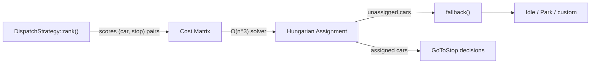

# Writing a Custom Dispatch Strategy

The built-in strategies ([SCAN, LOOK, NearestCar, ETD, Destination](dispatch-strategies.md)) cover most general-purpose needs. Write a custom strategy when you need domain-specific behavior the built-ins don't capture -- priority lanes, VIP handling, freight vs. passenger separation, fairness guarantees, energy-aware dispatch.

This chapter is a narrative tutorial that walks from a minimal strategy to a production-grade one with snapshot support. If you just need a quick overview, the [Dispatch Strategies](dispatch-strategies.md) chapter has one.

## How dispatch works

Strategies express preference as a cost on each `(car, stop)` pair. The dispatch system collects those costs into a matrix and solves the optimal assignment across the whole group, guaranteeing that two cars are never sent to the same hall call. Cars left unassigned fall through to `fallback` for per-car policy (idle, park, etc.). (The solver is the Hungarian / Kuhn-Munkres algorithm -- you don't need to know how it works, just that it finds the globally optimal matching.)



## The trait surface

```text
pub trait DispatchStrategy: Send + Sync {
    /// Pre-pass hook with mutable world access. Used by sticky strategies
    /// (e.g. destination dispatch) to commit rider -> car assignments.
    fn pre_dispatch(
        &mut self,
        _group: &ElevatorGroup,
        _manifest: &DispatchManifest,
        _world: &mut World,
    ) { /* default: no-op */ }

    /// Per-car setup called once before any `rank` calls for this car.
    /// Strategies with per-car state (sweep direction, queue pointers)
    /// refresh it here so `rank` is order-independent over stops.
    fn prepare_car(
        &mut self,
        _car: EntityId,
        _car_position: f64,
        _group: &ElevatorGroup,
        _manifest: &DispatchManifest,
        _world: &World,
    ) { /* default: no-op */ }

    /// Score sending `car` to `stop`. Lower is better. `None` marks
    /// the pair unavailable (capacity limits, wrong-direction, sticky).
    /// Must return a finite, non-negative value when `Some`.
    fn rank(&mut self, ctx: &RankContext<'_>) -> Option<f64>;

    /// Decide what a car should do when the assignment phase couldn't
    /// give it a stop (no demand or all candidate ranks were `None`).
    fn fallback(
        &mut self,
        _car: EntityId,
        _car_position: f64,
        _group: &ElevatorGroup,
        _manifest: &DispatchManifest,
        _world: &World,
    ) -> DispatchDecision { DispatchDecision::Idle }

    /// Clean up per-elevator state when a car leaves the group.
    /// Strategies with internal `HashMap<EntityId, _>` state must
    /// remove the entry here -- otherwise the map grows unbounded.
    fn notify_removed(&mut self, _elevator: EntityId) { /* default: no-op */ }
}
```

`RankContext` bundles the per-call arguments into a single struct:

```text
pub struct RankContext<'a> {
    pub car: EntityId,
    pub car_position: f64,
    pub stop: EntityId,
    pub stop_position: f64,
    pub group: &'a ElevatorGroup,
    pub manifest: &'a DispatchManifest,
    pub world: &'a World,
}
```

Only `rank` is required. The default `fallback` returns `Idle`; the other hooks exist for strategies that need them.

## Step 1 -- The simplest possible strategy

"Nearest-car by distance, favoring stops with more waiting riders."

```rust,no_run
use elevator_core::dispatch::{DispatchStrategy, RankContext};

struct BusyStopNearest;

impl DispatchStrategy for BusyStopNearest {
    fn rank(&mut self, ctx: &RankContext<'_>) -> Option<f64> {
        let distance = (ctx.car_position - ctx.stop_position).abs();
        let waiting = ctx.manifest.waiting_count_at(ctx.stop) as f64;
        // Subtract a crowding bonus so busier stops look cheaper. Clamp
        // so the solver never sees a negative cost.
        Some((distance - waiting).max(0.0))
    }
}
```

What this gets you automatically:

- **Coordination across cars** -- the Hungarian solver never sends two cars to the same hall call.
- **Direction indicators** driven by the `GoToStop` decision vs. car position.
- **`DestinationQueue` management** handled by later phases -- you don't touch it.
- **Dispatch events** (`ElevatorAssigned`, `ElevatorIdle`, `DirectionIndicatorChanged`) emit automatically.

Returning `None` from `rank` excludes a `(car, stop)` pair entirely -- use it for capacity limits, wrong-direction stops, or restricted stops. When every candidate stop returns `None` (or there are no demanded stops at all), the dispatcher calls `fallback`, which defaults to `Idle`.

## Step 2 -- Per-car state with `prepare_car`

Strategies whose ranking depends on per-car state (a sweep direction, a queue pointer, a cached priority) should refresh that state in `prepare_car`. The framework calls it once per car per pass, before any `rank` calls for that car, so the subsequent `rank` results are independent of the order the dispatcher iterates stops.

The built-in `ScanDispatch` uses this hook to decide whether the car's sweep direction should flip for the current pass. That decision depends on whole-group demand, so doing it inside `rank` would give different answers depending on which stop was scored first.

```rust,no_run
use std::collections::HashMap;
use elevator_core::dispatch::{
    DispatchManifest, DispatchStrategy, ElevatorGroup, RankContext,
};
use elevator_core::entity::EntityId;
use elevator_core::world::World;

struct DirectionalDispatch {
    /// Tracks the preferred sweep direction per car.
    sweep_up: HashMap<EntityId, bool>,
}

impl DispatchStrategy for DirectionalDispatch {
    fn prepare_car(
        &mut self,
        car: EntityId,
        car_position: f64,
        group: &ElevatorGroup,
        manifest: &DispatchManifest,
        world: &World,
    ) {
        // Decide sweep direction based on where demand is heaviest
        // relative to this car. This runs once per car, before any
        // rank() calls for that car.
        let demand_above = group.stop_entities().iter().filter(|&&s| {
            manifest.waiting_count_at(s) > 0
                && world.stop_position(s).map_or(false, |p| p > car_position)
        }).count();
        let demand_below = group.stop_entities().iter().filter(|&&s| {
            manifest.waiting_count_at(s) > 0
                && world.stop_position(s).map_or(false, |p| p < car_position)
        }).count();
        self.sweep_up.insert(car, demand_above >= demand_below);
    }

    fn rank(&mut self, ctx: &RankContext<'_>) -> Option<f64> {
        let going_up = self.sweep_up.get(&ctx.car).copied().unwrap_or(true);
        let is_ahead = if going_up {
            ctx.stop_position >= ctx.car_position
        } else {
            ctx.stop_position <= ctx.car_position
        };
        if is_ahead {
            Some((ctx.car_position - ctx.stop_position).abs())
        } else {
            // Penalize stops behind the sweep direction.
            Some((ctx.car_position - ctx.stop_position).abs() + 1000.0)
        }
    }

    fn notify_removed(&mut self, elevator: EntityId) {
        self.sweep_up.remove(&elevator);
    }
}
```

## Step 3 -- Carrying state, and the `notify_removed` contract

If your strategy tracks something per elevator (direction history, last-served stop, priority bookkeeping), it owns a `HashMap<EntityId, _>`. That map must be cleaned up when an elevator is removed or reassigned across groups, or it grows forever.

The framework calls `notify_removed(elevator)` on the group's dispatcher whenever:

1. `Simulation::remove_elevator(id)` is called, OR
2. `Simulation::reassign_elevator_to_line(id, new_line)` moves an elevator *across groups* (same-group moves don't fire `notify_removed` because the dispatcher still owns the elevator).

Forgetting to implement this is the most common correctness bug in custom strategies. `ScanDispatch` and `LookDispatch` both use it to evict direction entries.

```text
use std::collections::HashMap;

#[derive(Default)]
struct PriorityDispatch {
    /// Per-elevator cooldown -- once this elevator served a priority stop,
    /// suppress priority preference for N ticks so non-priority riders
    /// aren't starved.
    cooldown_ticks: HashMap<EntityId, u64>,
}

impl DispatchStrategy for PriorityDispatch {
    fn rank(/* ... */) -> Option<f64> { /* ... */ }

    fn notify_removed(&mut self, elevator: EntityId) {
        // CRITICAL: keeps the map from growing unbounded under churn.
        self.cooldown_ticks.remove(&elevator);
    }
}
```

## Step 4 -- Snapshot support

Simulations can be serialized via `Simulation::snapshot()` for save/load, replay, and deterministic testing. The snapshot records each group's dispatch strategy by name. Built-in strategies serialize to specific variants (`BuiltinStrategy::Scan`, `::Look`, `::NearestCar`, `::Etd`, `::Rsr`, `::Destination`); custom strategies serialize to `BuiltinStrategy::Custom(String)`.

On restore, `WorldSnapshot::restore()` takes an optional factory function that maps the custom name back to a strategy instance. If your custom strategy doesn't identify itself via `builtin_id` (see below), the sim silently records `BuiltinStrategy::Scan` instead -- the snapshot name is wrong and the factory never gets called on restore.

The canonical pattern uses two hooks on the `DispatchStrategy` trait:

- **`builtin_id()`** advertises the snapshot name. Override it to return `BuiltinStrategy::Custom("name")` so `Simulation::new` / the builder / `set_dispatch` all record the right identity, regardless of which entry point the caller uses.
- **`snapshot_config()` / `restore_config()`** (optional) round-trip any tunable configuration. Without overriding, the restored instance runs with whatever defaults the factory produces. Override them if your strategy has runtime-tunable weights or other state that should survive a save.

```rust,no_run
use elevator_core::prelude::*;
use elevator_core::config::ElevatorConfig;
use elevator_core::dispatch::{BuiltinStrategy, DispatchStrategy, RankContext};
use elevator_core::snapshot::WorldSnapshot;
use serde::{Deserialize, Serialize};

const PRIORITY_NAME: &str = "priority";

#[derive(Default, Serialize, Deserialize)]
struct PriorityDispatch {
    urgency_boost: f64,
}

impl DispatchStrategy for PriorityDispatch {
    // Real implementations score against `ctx`; see `BusyStopNearest` above.
    fn rank(&mut self, _ctx: &RankContext<'_>) -> Option<f64> { Some(0.0) }

    fn builtin_id(&self) -> Option<BuiltinStrategy> {
        // Identify the strategy to the snapshot layer. Keep this name
        // stable across releases -- changing it breaks old saves.
        Some(BuiltinStrategy::Custom(PRIORITY_NAME.into()))
    }

    fn snapshot_config(&self) -> Option<String> {
        ron::to_string(self).ok()
    }

    fn restore_config(&mut self, serialized: &str) -> Result<(), String> {
        let restored: Self = ron::from_str(serialized).map_err(|e| e.to_string())?;
        *self = restored;
        Ok(())
    }
}

fn run(snapshot: WorldSnapshot) -> Result<(), SimError> {
    // `Simulation::new` and the builder consult `builtin_id` so you can
    // drop the strategy in without a second id argument -- the snapshot
    // records `BuiltinStrategy::Custom("priority")` automatically.
    let _sim = SimulationBuilder::new()
        .stop(StopId(0), "Ground", 0.0)
        .stop(StopId(1), "Top", 10.0)
        .elevator(ElevatorConfig::default())
        .dispatch(PriorityDispatch::default())
        .build()?;

    // When restoring, the factory maps names back to strategy instances.
    // `restore_config` replays `urgency_boost` onto the new instance.
    let sim = snapshot.restore(Some(&|name: &str| -> Option<Box<dyn DispatchStrategy>> {
        match name {
            PRIORITY_NAME => Some(Box::new(PriorityDispatch::default())),
            // Return `None` for unknown names -- the restore records a
            // `SnapshotDanglingReference` event and falls back to
            // `ScanDispatch` rather than panicking.
            _ => None,
        }
    }))?;
    let _ = sim;
    Ok(())
}
```

The name is opaque to the library. Keep it stable across releases -- changing the name breaks old saved snapshots.

## Step 5 -- Testing a custom strategy

Two levels of test coverage work well:

**Unit-test through `dispatch::assign` in isolation.** Construct a minimal `World`, an `ElevatorGroup`, and a `DispatchManifest`, then run one assignment pass. This exercises the Hungarian matching and `fallback` path end-to-end, so the test reflects real runtime behavior. See `crates/elevator-core/src/tests/dispatch_tests.rs` for the helper pattern (`test_world()`, `test_group()`, `spawn_elevator()`, `add_demand()`).

**Integration-test via a full `Simulation`.** Spawn riders, step the loop, assert on events (`ElevatorAssigned`, `RiderBoarded`, etc.). This catches bugs that only surface through the 8-phase interaction -- e.g., a strategy that excludes every `(car, stop)` pair it shouldn't, or one whose `prepare_car` mutation leaves stale state between passes.

```rust,no_run
# use elevator_core::prelude::*;
# use elevator_core::__doctest_prelude::*;
# struct BusyStopNearest;
# impl DispatchStrategy for BusyStopNearest {
#     fn rank(&mut self, _ctx: &RankContext<'_>) -> Option<f64> { Some(0.0) }
# }
#[test]
fn custom_strategy_assigns_nearest_car() {
    let mut sim = SimulationBuilder::new()
        .stop(StopId(0), "Ground", 0.0)
        .stop(StopId(1), "Top", 10.0)
        .elevator(ElevatorConfig::default())
        .dispatch(BusyStopNearest)
        .build()
        .unwrap();

    sim.spawn_rider(StopId(0), StopId(1), 75.0).unwrap();
    sim.step();

    let events = sim.drain_events();
    assert!(events.iter().any(|e| matches!(e, Event::ElevatorAssigned { .. })));
}
```

See [Testing Your Simulation](testing.md) for broader testing patterns including snapshot round-trips and deterministic replay.

## Performance considerations

- `rank` runs O(cars x stops) per tick per group, and the Hungarian solver itself is O(n^3) in the group size. At 60 ticks/second and a realistic group (20 cars, 50 stops), that's millions of `rank` calls per simulated minute -- keep the hot path allocation-free and `manifest` lookups cheap.
- `SmallVec<[T; N]>` is already the storage choice in the built-in strategies for intermediate partitions. If your strategy partitions cars or stops, consider the same.
- The `DispatchManifest` is immutable -- never try to mutate demand from inside `rank`. If you need per-rider state across ticks, store it in your strategy.
- Avoid iterating `HashMap<EntityId, _>` in the hot path -- order is nondeterministic. Use `BTreeMap` or sort keys before iteration.

## Putting it together: a runnable example

See [`examples/custom_dispatch.rs`](https://github.com/andymai/elevator-core/blob/main/crates/elevator-core/examples/custom_dispatch.rs) in the repository -- a complete file implementing a round-robin strategy with all three trait methods, ready to `cargo run --example custom_dispatch`.

## Next steps

- [Extensions](extensions.md) -- attach per-rider / per-elevator data (VIP tags, priority, preferences) that your strategy can consult via `world.get_ext::<T>(id)`.
- [Snapshots and Determinism](snapshots-determinism.md) -- full snapshot/restore cycle, with emphasis on the custom-strategy factory.
- [Events and Metrics](events-metrics.md) -- what dispatch emits and how to consume it for debugging.
