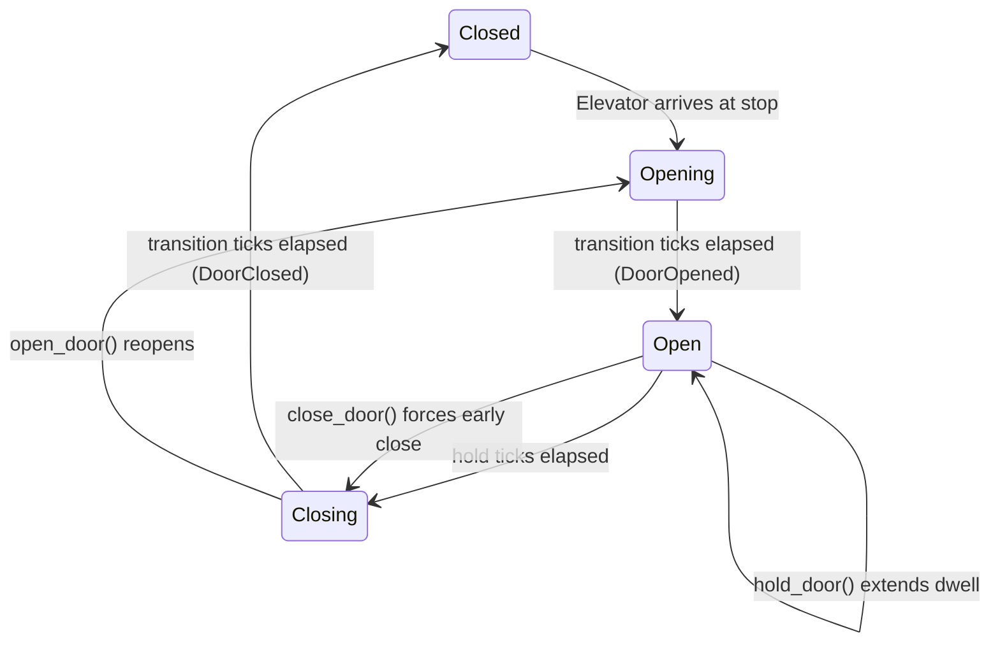

# Door Control

Doors gate when riders can board and exit. Each elevator has a `DoorState` finite-state machine that ticks during the Doors phase. This chapter covers the FSM, timing configuration, manual door commands, and the events they produce.

## DoorState FSM

Doors cycle through four states:



| State | What is happening |
|---|---|
| `Closed` | Doors fully shut. Elevator may move. |
| `Opening { ticks_remaining, .. }` | Doors in transit. Riders cannot board yet. |
| `Open { ticks_remaining, .. }` | Doors fully open. Riders board and exit during the Loading phase. |
| `Closing { ticks_remaining }` | Doors in transit. No boarding. |

When an elevator arrives at its target stop, the door transitions to `Opening`. After the transition completes, the elevator enters the `Loading` phase where riders board and exit. Once the hold timer expires, doors begin closing. After closing completes, the elevator enters `Stopped` and becomes available for the next dispatch assignment.

## Door timing config

Two parameters on `ElevatorConfig` control door timing:

| Parameter | Default | Description |
|---|---|---|
| `door_transition_ticks` | `5` | Ticks for the opening and closing transitions |
| `door_open_ticks` | `10` | Ticks the doors stay fully open before closing |

A full door cycle takes `door_transition_ticks * 2 + door_open_ticks` ticks. With defaults, that is 20 ticks per stop visit.

You can change these at runtime:

```rust,no_run
# use elevator_core::prelude::*;
# use elevator_core::__doctest_prelude::*;
# let mut sim: Simulation = todo!();
# let elev: ElevatorId = todo!();
sim.set_door_transition_ticks(elev, 3).unwrap();
sim.set_door_open_ticks(elev, 15).unwrap();
```

Changes apply on the **next** door cycle. An in-progress transition keeps its original timing.

## Manual door commands

Four methods let game code override automatic door behavior:

| Method | DoorCommand | Effect |
|---|---|---|
| `sim.open_door(elev)` | `Open` | Open doors now, or on arrival at the next stop |
| `sim.close_door(elev)` | `Close` | Close doors now, or as soon as loading finishes |
| `sim.hold_door(elev, ticks)` | `HoldOpen { ticks }` | Extend the open dwell by `ticks` (cumulative) |
| `sim.cancel_door_hold(elev)` | `CancelHold` | Cancel any pending hold extension |

Commands are queued on the target elevator and processed at the start of the Doors phase. Commands that are not yet valid (e.g., `Open` while already opening) stay queued until they become applicable.

Here is a practical example -- hold doors for a late arrival, then force them shut:

```rust,no_run
# use elevator_core::prelude::*;
# use elevator_core::__doctest_prelude::*;
# let mut sim: Simulation = todo!();
# let elev: ElevatorId = todo!();
// A friend is running for the elevator -- hold the doors.
sim.hold_door(elev, 60).unwrap();

// Friend made it aboard. Force the doors closed early.
sim.close_door(elev).unwrap();
```

## Door events

| Event | When it fires |
|---|---|
| `DoorOpened { elevator, tick }` | Doors finish opening (transition to `Open`) |
| `DoorClosed { elevator, tick }` | Doors finish closing (transition to `Closed`) |
| `DoorCommandQueued { elevator, command, tick }` | A manual command was accepted onto the queue |
| `DoorCommandApplied { elevator, command, tick }` | A queued command took effect |

The `Queued`/`Applied` pair is useful for driving UI feedback (button flash, sound effect) without polling the elevator every tick. A command is queued immediately when you call `open_door()` etc., but may not be applied until a later tick when the door state is compatible.

## Interaction with Loading

Riders can only board or exit when the doors are **fully open** (`DoorState::Open`). The Loading phase runs after the Doors phase each tick, so the sequence within a single tick is:

1. Doors phase ticks the FSM. If `Opening` completes, the elevator transitions to `Loading` phase.
2. Loading phase checks all elevators in `Loading` phase. One rider action per elevator per tick: exit takes priority over boarding.
3. When the hold timer expires, doors begin closing. No more boarding until the next door-open cycle.

Since only one rider boards per tick and doors close after `door_open_ticks` ticks, the maximum riders boarding per stop visit equals `door_open_ticks`. If riders are queueing up, increase `door_open_ticks` to let more board per visit.

## Next steps

- [Movement and Physics](movement-physics.md) -- how elevators travel between stops
- [Rider Lifecycle](rider-lifecycle.md) -- what happens to riders once they board
- [Events and Metrics](events-metrics.md) -- door events in the broader event system
