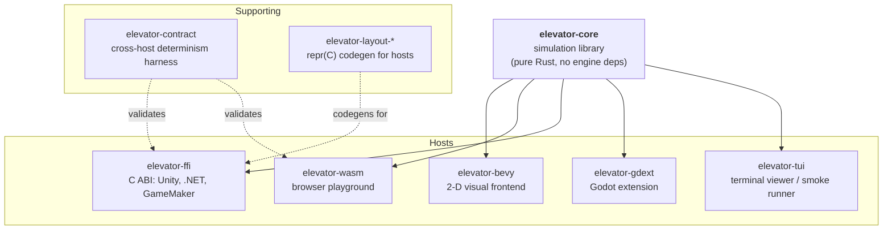

# Introduction

**elevator-core** is an engine-agnostic elevator simulation library written in pure Rust. You define stops at arbitrary positions on a 1-D axis, spawn riders, and step the tick loop — the engine handles dispatch, trapezoidal motion, doors, boarding, and metrics. Your code reacts to a typed event stream.

> **▶ Try it live:** the [in-browser playground](./playground/index.html) runs the full simulation. Race two dispatch strategies on the same traffic, side-by-side, no install.

## Who this is for

- **Game developers** dropping a ready-made elevator into Bevy, macroquad, Godot, Unity, or a homebrew engine.
- **Algorithm researchers** prototyping dispatch strategies (SCAN, LOOK, ETD, RSR, or your own) on a deterministic, snapshot-able simulation.
- **Educators** teaching scheduling, real-time systems, or queueing through a visual, interactive testbed.
- **Hobbyists** who think elevators are neat. (You're correct.)

## What you can build

The library models stops at arbitrary distances along a shaft axis, not uniform floors. Position is a plain `f64`; the bundled `assets/config/space_elevator.ron` stretches the same engine to 1,000 distance units between two stops as a stress test. A few examples:

| Scenario | How |
|---|---|
| Office building with 5 floors | Stops at 0, 4, 8, 12, 16 |
| Skyscraper with sky lobbies | Multi-group dispatch with express zones |
| Space elevator / orbital tether | Stops at 0 and 1,000 — same engine |
| Player-controlled car | `ServiceMode::Manual` + direct velocity commands |
| Custom AI dispatch | Implement `DispatchStrategy::rank()` |
| VIP passengers, cargo, robots | Extension storage — attach any typed data |

The core crate provides primitives, not opinions. A rider is anything that rides; you decide whether they are tenants, hotel guests, hospital patients, miners, or freight pallets, and attach the semantics through the [extension storage system](extensions.md).

## What it isn't

- **Not a renderer.** No graphics, no windowing, no audio. The core crate is headless; see [Bevy Integration](bevy-integration.md) for a 2-D visual wrapper.
- **Not real-time.** The tick loop runs as fast as you drive it. There is no wall-clock coupling — a tick is whatever `ticks_per_second` says it is. Games layer real-time scheduling on top.
- **Not an ECS framework.** It uses an ECS-inspired internal layout but exposes a focused simulation API, not a general-purpose ECS.
- **Not networked or multi-building.** One simulation per process. Federation, multiplayer, and cross-building routing are out of scope.
- **Not an optimizer.** Built-in dispatch strategies are reference implementations — fast enough for most consumers, but not tuned for any specific building. Bring your own algorithm if you need optimal performance.

## Workspace at a glance

The simulation core sits at the centre. Host crates wrap it for a target engine; supporting crates exist only to keep the hosts in sync.

`elevator-core` is the only crate published to crates.io as a library; the hosts ship through their target ecosystems. See [Supporting Crates](supporting-crates.md) for what each supporting crate does and [Using the Bindings](using-the-bindings.md) for host integration walkthroughs.

## Determinism in one paragraph

Given the same initial config and the same sequence of API calls, the simulation is byte-for-byte deterministic. The core loop contains no internal randomness; every tick phase is pure over the world state. The built-in `PoissonSource` traffic generator uses an OS-seeded RNG and is *not* deterministic — for reproducible traffic, plug in a seeded `TrafficSource`. See [Snapshots and Determinism](snapshots-determinism.md) for the contract, save/load, and replay patterns.

## Stability and MSRV

- **MSRV:** Rust 1.88 (uses let-chains, stabilised in 1.88; a CI job pinned to the exact MSRV keeps this honest).
- **Versioning:** Semver. Breaking changes bump the major version. Adding variants to `#[non_exhaustive]` enums (events, errors) is *not* breaking.
- **Release cadence:** managed via release-please; see [`CHANGELOG.md`](https://github.com/andymai/elevator-core/blob/main/CHANGELOG.md).
- **Per-item classification:** see [Stability and Versioning](stability.md).

## Links

- [API Reference (docs.rs)](https://docs.rs/elevator-core)
- [crates.io](https://crates.io/crates/elevator-core)
- [GitHub](https://github.com/andymai/elevator-core)

## Next steps

- [Quick Start](quick-start.md) — build your first simulation in under 30 lines.
- [Stops, Lines, and Groups](stops-lines-groups.md) — the topology model that lets one engine run an office, a skyscraper, or a space tether.
- [Supporting Crates](supporting-crates.md) — supporting crates that keep the host bindings honest.
