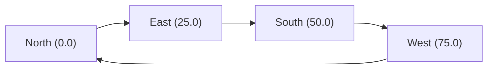

# Loop Lines

Closed-loop transit topologies -- people-movers, gondolas, monorails, airport pedways -- aren't elevator shafts. They're one-way cycles where every served stop is reachable forward through the line, and "up vs. down" doesn't apply. The `loop_lines` cargo feature adds a `LineKind::Loop` variant that captures this topology end-to-end: cyclic position math, headway-clamped multi-car ordering, two dispatch strategies (`LoopSweep` and `LoopSchedule`), and the FSM adaptations that keep Loop cars patrolling continuously without ever entering `Idle`.

The feature is off by default. Hosts that want to load Loop scenarios opt in via their `Cargo.toml`:

```toml
elevator-core = { path = "../elevator-core", features = ["loop_lines"] }
```

The shipped `elevator-bevy`, `elevator-tui`, and `elevator-wasm` hosts enable the feature out of the box. `elevator-ffi` and `elevator-gdext` expose `loop_lines` as an opt-in cargo feature; enable it at build time when shipping a Unity / GameMaker / .NET / Godot integration that needs the Loop topology query surface (`ev_sim_is_loop`, `ev_sim_loop_*` / `is_loop`, `loop_*`).

## When to use a loop

Pick `LineKind::Loop` whenever the physical layout is a closed cycle and the line is one-way. Examples:

- Airport people-movers and parking shuttles
- Theme-park monorails and gondolas
- Mining haul-truck circuits
- Conveyor-style horizontal transport between two towers

If "up" and "down" are meaningful on the line, it's a `Linear` shaft; use the default topology. Mixing Loop and Linear lines in the same group is rejected at construction -- see [Group homogeneity](#group-homogeneity).

## Topology



A `LineKind::Loop` is configured with two fields:

```ron
kind: Some(Loop(
    circumference: 100.0,
    min_headway: 8.0,
)),
```

- **`circumference`** -- total path length of the loop, in the same distance units as stops. Positions on the line are normalised modulo `circumference`, so a car at position `125.0` on a 100-unit loop is treated as position `25.0`.
- **`min_headway`** -- minimum cyclic arc between consecutive cars. Construction validates `max_cars * min_headway <= circumference`, so a misconfigured loop that couldn't fit every car at full headway is rejected up front.

Stops on a Loop are listed by ID under `serves`. Position determines cyclic order; the lowest-position stop isn't special. Stops sharing a position on the same Loop are rejected (cyclic order would be ambiguous).

## Group homogeneity

A group is either all-Linear or all-Loop. Mixing the topologies in one group is rejected at construction:

```text
error: group 0 mixes Loop and Linear lines; groups must be homogeneous
```

The dispatch and reposition strategies that drive a group don't compose across topologies. Loop strategies (`LoopSweep`, `LoopSchedule`) reject Linear ranking; Linear strategies (`Scan`, `Look`, etc.) reject Loop semantics. Splitting the lines into separate groups keeps each group's strategy honest.

Loop groups additionally:

- Reject reposition strategies (Loop cars never enter `Idle`, so there's nothing to reposition).
- Reject every dispatch strategy except `LoopSweep` and `LoopSchedule`.

## Dispatch strategies

Two dispatch strategies are available for Loop groups:

### `LoopSweep` -- call-driven patrol

Every Loop car patrols forward continuously, boarding every eligible rider at every served stop. Dwell at each stop tracks rider load via the per-car `door_open_ticks` -- a stop with many waiters takes longer than an empty one. This is the default choice for "every car serves everyone, every lap" scenarios.

```ron
GroupConfig(
    id: 0,
    name: "Loop Service",
    lines: [1],
    dispatch: LoopSweep,
),
```

### `LoopSchedule` -- fixed-dwell timetable

Every Loop car spends a uniform `dwell_ticks` at every stop, producing a predictable timetable. Useful for people-mover lines, gondolas, and timetabled shuttle services where consistent cadence matters more than load-shaped dwell.

`LoopSchedule` also runs **hold-recovery**: when a car arrives at a stop within `target_headway_ticks` of the preceding arrival, it extends its dwell by `min(target_headway_ticks - gap, hold_cap_ticks)` to recover the schedule. The cap prevents a stuck leader from freezing the follower indefinitely.

```rust,no_run
use elevator_core::dispatch::LoopScheduleDispatch;

// 30-tick dwell, 600-tick target headway, 120-tick cap.
let schedule = LoopScheduleDispatch::new(30, 600, 120);
```

Hold-recovery never speeds a car up -- it can only delay followers running ahead of their schedule slot. The no-overtake invariant on Loop lines is preserved.

## Loop-aware FSM adaptations

Several pieces of the engine behave differently on Loop lines:

- **No `Idle` phase**: a Loop car constructed in `Idle` is kickstarted to `MovingToStop(forward_next_stop)` at the start of the next dispatch tick, and the door FSM hands the car straight from `DoorClosing` to `MovingToStop(next)` rather than `Stopped`. Loop cars patrol continuously.
- **Direction indicator**: Loop cars report `Direction::Forward` instead of `Up` / `Down` / `Either`. The `going_up` / `going_down` lamps are explicitly cleared and `going_forward` is set true.
- **Boarding gate bypassed**: the linear `(dest_pos > stop_pos) -> requires going_up` filter is meaningless on a cycle. Loop cars board every rider eligible by capacity and route.
- **Reposition no-op**: even with a (now-rejected) reposition strategy installed, the reposition phase explicitly skips Loop cars.
- **`OutOfService` rejected with followers**: putting a Loop car into `OutOfService` would freeze every car behind it on the loop. Construction rejects the transition unless the car has zero followers (single-car loops are allowed).

## Example: the shipped demo

`assets/config/loop_demo.ron` ships a 4-stop, 2-car loop:

```text
Stops:        North (0)  East (25)  South (50)  West (75)
Loop:         circumference 100, min_headway 8
Cars:         Car 1 starts at North, Car 2 starts at South
Dispatch:     LoopSweep (call-driven)
Spawning:     ~1 rider/sec on the demo's 60 Hz tick rate
```

Run it from the Bevy host:

```bash
cargo run -- assets/config/loop_demo.ron
```

Both cars patrol forward indefinitely, board waiting riders at every stop, and deliver them around the cycle to their destinations. The headway clamp keeps Car 2 from overtaking Car 1 even when Car 1 stops for a heavy boarding burst.

## Snapshots

`LineKind` round-trips through snapshots. Snapshots taken with a Loop scenario can be restored into another sim with the feature enabled. A snapshot containing `LineKind::Loop` cannot be restored by a sim built without the `loop_lines` feature -- deserialization rejects the variant outright.

The wire format will keep the legacy flat `min_position` / `max_position` fields alongside `kind` for one release after this feature lands, to give snapshots produced by pre-feature sims a deterministic deserialization path. Once that release cycle passes, the flat fields will be removed.

## Driving a Loop car manually

A host that wants to drive a Loop car directly (player-controlled gondola, AI-scripted train, etc.) puts the car in `ServiceMode::Manual` and sets its target velocity:

```rust,no_run
# use elevator_core::components::ServiceMode;
# use elevator_core::sim::Simulation;
# use elevator_core::entity::ElevatorId;
# fn drive(sim: &mut Simulation, car: ElevatorId) -> Result<(), elevator_core::error::SimError> {
sim.set_service_mode(car.entity(), ServiceMode::Manual)?;
sim.set_target_velocity(car, 2.5)?;
# Ok(()) }
```

Two invariants distinguish Manual on a Loop from Manual on a Linear shaft:

- **One-way:** `set_target_velocity` rejects negative targets with `SimError::InvalidConfig { field: "target_velocity", .. }`. Loops are closed cycles; "reverse" has no physical meaning, and silently clamping to zero would surprise authors. Hosts should surface the error as a UX warning.
- **Headway-clamped:** the integrator pulls each tick's landing back to `leader - min_headway` along the forward direction. A player flooring the throttle into the car ahead produces a "soft collision" — the car physically stops at the headway boundary and `velocity` is zeroed. Releasing throttle or waiting for the leader to move releases the clamp on the next tick.

For loop-aware game UI, the simulation exposes:

| Method | What it returns |
|---|---|
| `is_loop(line)` | Whether the line uses `LineKind::Loop` |
| `loop_circumference(line)` | Total path length, or `None` for Linear |
| `loop_next_stop(line, position)` | Forward-most stop after `position` |
| `loop_leader(elevator)` | Forward-nearest elevator on the same Loop, or `None` for a solo car |
| `loop_forward_gap(elevator)` | Cyclic arc from `elevator` to its leader in `[0, C)` |

Hosts use `loop_forward_gap` together with the line's `min_headway` to detect a car pressed against the clamp ("can't advance — gap == min_headway"), then surface that state in HUDs or AI behaviour.

## Out of scope for v1

The `loop_lines` v1 ships **one-way** loops only. The following are explicitly out of scope and rejected at construction or runtime:

- Bidirectional loops
- Pull-a-car-out-of-the-loop with follower retargeting (a Loop car can be put `OutOfService` only when it has no followers)
- Block signalling for multi-segment lines

Future iterations may revisit these once the v1 surface has soaked.

## Next steps

- [Dispatch Strategies](dispatch-strategies.md) -- the broader strategy interface that `LoopSweep` and `LoopSchedule` plug into
- [Stops, Lines, and Groups](stops-lines-groups.md) -- the topology primitives `LineKind` extends
- [Movement and Physics](movement-physics.md) -- the trapezoidal integrator that the cyclic seam-split builds on
- [Configuration](configuration.md) -- the RON schema `loop_demo.ron` uses
