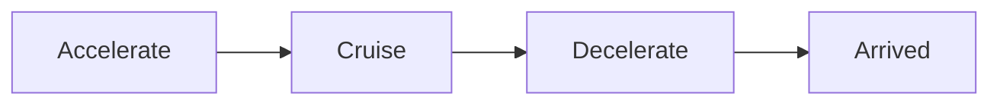

# Movement and Physics

Elevator movement uses a trapezoidal velocity profile -- accelerate, cruise at max speed, decelerate to stop precisely at the target. This chapter covers the physics model, per-elevator parameters, position interpolation for rendering, ETA queries, and passing-floor detection.

## Trapezoidal velocity profile

Each tick, `tick_movement()` advances an elevator's position and velocity through three regions:



- **Accelerate** -- speed increases by `acceleration * dt` per tick until reaching `max_speed`.
- **Cruise** -- speed holds at `max_speed` while the remaining distance exceeds the braking distance.
- **Decelerate** -- speed decreases by `deceleration * dt` per tick, arriving at the target with velocity near zero.

For short trips where the elevator cannot reach max speed, the profile becomes triangular: accelerate then immediately decelerate. The system handles this automatically -- no special configuration needed.

## Per-elevator physics parameters

Physics are configured per-elevator on `ElevatorConfig`:

| Parameter | Type | Default | Description |
|---|---|---|---|
| `max_speed` | `Speed` | `2.0` | Maximum speed magnitude |
| `acceleration` | `Accel` | `1.5` | Rate of acceleration (positive) |
| `deceleration` | `Accel` | `2.0` | Rate of deceleration (positive) |

All three are stored on the `Elevator` component at runtime, so different elevators (express vs. local, freight vs. passenger) can have different physics in the same simulation.

## Braking distance

The `braking_distance()` function computes the distance required to stop from a given velocity:

```rust,no_run
use elevator_core::movement::braking_distance;

let distance = braking_distance(2.5, 1.0);  // v=2.5, decel=1.0
// distance = v^2 / (2 * a) = 3.125
```

This is useful for custom dispatch strategies that want to consider opportunistic stops -- whether an elevator passing a floor can brake in time. The `Simulation` also exposes `sim.braking_distance(elev)` to get the current braking distance for a specific elevator without reimplementing the physics.

## Position interpolation

Game renderers typically run at a higher framerate than the simulation tick rate. To produce smooth motion between ticks, use `position_at()` with an interpolation alpha:

```rust,no_run
# use elevator_core::prelude::*;
# let sim: Simulation = todo!();
# let elev: EntityId = todo!();
// alpha = 0.0 is the position at tick start, 1.0 at tick end.
let p_start = sim.position_at(elev, 0.0).unwrap();
let p_mid   = sim.position_at(elev, 0.5).unwrap();
let p_end   = sim.position_at(elev, 1.0).unwrap();
```

A typical render loop at 4x the sim rate samples at `alpha = 0.0, 0.25, 0.5, 0.75`:

```rust,no_run
# use elevator_core::prelude::*;
# let mut sim: Simulation = todo!();
# let elev: EntityId = todo!();
sim.step();

// Render 4 sub-frames per tick.
for i in 0..4 {
    let alpha = i as f64 / 4.0;
    let y = sim.position_at(elev, alpha).unwrap();
    // Set camera or sprite position to y.
}
```

The current velocity is available via `sim.velocity(elev)`, which returns the raw `f64` value (signed, positive = upward).

## ETA queries

Two methods estimate arrival times for UI countdown displays and dispatch logic:

**`sim.eta(elevator, stop)`** -- returns a `Duration` estimating how long until `elevator` reaches `stop`, based on its current queue and trapezoidal physics. The estimate assumes no mid-trip changes (door commands, new riders, dispatch reassignment).

**`sim.best_eta(stop, direction)`** -- returns the `(EntityId, Duration)` of the elevator with the shortest ETA to a stop in the given direction, or `None` if no eligible car has that stop queued.

```rust,no_run
# use elevator_core::prelude::*;
# use elevator_core::components::Direction;
# let sim: Simulation = todo!();
# let elev: ElevatorId = todo!();
# let lobby: EntityId = todo!();
// How long until this specific elevator reaches the lobby?
match sim.eta(elev, lobby) {
    Ok(duration) => println!("ETA: {duration:.1?}"),
    Err(e) => println!("Cannot estimate: {e}"),
}

// Which elevator will reach the lobby soonest (going down)?
if let Some((car, eta)) = sim.best_eta(lobby, Direction::Down) {
    println!("Car {car:?} arriving in {eta:.1?}");
}
```

ETA queries can fail with `EtaError` -- the elevator might not be headed to that stop, or it might be in an excluded service mode. See [Error Handling](error-handling.md) for details.

## PassingFloor events

When an elevator passes a stop without stopping, a `PassingFloor` event fires:

```rust,ignore
Event::PassingFloor { elevator, stop, moving_up, tick }
```

This is useful for:

- Playing a "ding" or updating a floor indicator in your game UI
- Custom dispatch strategies that react to passing traffic
- Analytics on which floors see the most pass-throughs

### SortedStops resource

Passing-floor detection uses the `SortedStops` resource internally -- a sorted list of `(position, EntityId)` pairs that enables O(log n) binary search to find which stops an elevator crossed during a tick. This is an implementation detail; you do not interact with `SortedStops` directly.

## Next steps

- [Door Control](door-control.md) -- what happens when an elevator arrives at a stop
- [Dispatch Strategies](dispatch-strategies.md) -- how elevators decide where to go
- [Events and Metrics](events-metrics.md) -- `ElevatorArrived`, `PassingFloor`, and other movement events
