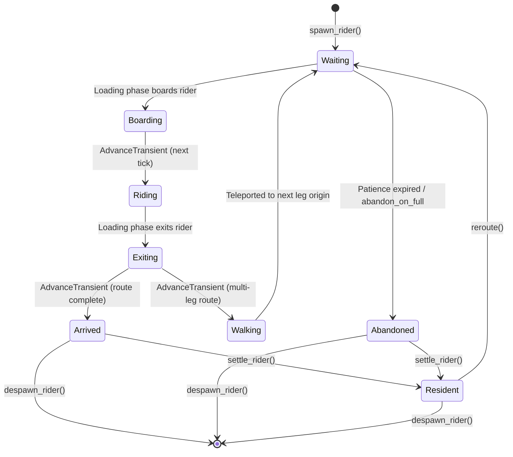

# Rider Lifecycle

Riders are the demand side of the simulation. A rider is anything that rides an elevator -- the library assigns no semantics beyond that. Games add meaning (passengers, NPCs, cargo) via [extension storage](extensions.md). This chapter covers the full lifecycle, patience and preferences, access control, and population tracking.

## Phase diagram

Every rider moves through a sequence of phases from spawn to final disposition:



## Phase table

| Phase | Where is the rider? | What triggers the transition? |
|---|---|---|
| `Waiting` | At a stop, in the queue | Loading phase boards the rider when an elevator arrives with open doors |
| `Boarding` | Being loaded into the elevator | AdvanceTransient phase advances to `Riding` on the next tick |
| `Riding` | Inside the elevator | Loading phase exits the rider when the elevator arrives at their destination |
| `Exiting` | Leaving the elevator | AdvanceTransient: becomes `Arrived` (route complete), or `Walking` (multi-leg) |
| `Walking` | Transferring between stops | Teleported immediately to the next leg's origin, then becomes `Waiting` |
| `Arrived` | At final destination | Your game decides: `settle_rider()`, `despawn_rider()`, or leave in place |
| `Abandoned` | Left the queue at a stop | Patience ran out or `abandon_on_full` triggered; your game can settle or despawn |
| `Resident` | Parked at a stop, not seeking an elevator | Your game called `settle_rider()` on an Arrived or Abandoned rider |

Each transition emits an event: `RiderSpawned`, `RiderBoarded`, `RiderExited`, `RiderAbandoned`, `RiderSettled`, `RiderRerouted`, `RiderDespawned`.

Note that `Boarding` and `Exiting` are **transient** -- they last exactly one tick. This gives events a clean boundary: the Loading phase sets the phase, and AdvanceTransient resolves it at the start of the next tick.

## Patience

Riders can have a patience budget that causes automatic abandonment. Attach a `Patience` component when spawning:

```rust,no_run
# use elevator_core::prelude::*;
# let mut sim: Simulation = todo!();
let rider = sim.build_rider(StopId(0), StopId(2))
    .unwrap()
    .weight(75.0)
    .patience(300)   // abandon after 300 ticks of waiting
    .spawn()
    .unwrap();
```

The `Patience` component tracks `max_wait_ticks` and `waited_ticks`. The counter increments only while the rider is in the `Waiting` phase -- ride time on multi-leg routes does not count against the budget. When `waited_ticks` exceeds `max_wait_ticks`, the rider transitions to `Abandoned` and a `RiderAbandoned` event fires.

## Preferences

The `Preferences` component controls boarding behavior:

| Field | Type | Default | Effect |
|---|---|---|---|
| `skip_full_elevator` | `bool` | `false` | Skip a crowded elevator and wait for the next one |
| `max_crowding_factor` | `f64` | `0.8` | Maximum load factor (0.0-1.0) the rider will tolerate |
| `balk_threshold_ticks` | `Option<u32>` | `None` | Abandon after N ticks of waiting (time-triggered) |
| `abandon_on_full` | `bool` | `false` | Abandon immediately on first full-car skip (event-triggered) |

The two abandonment paths are independent axes:

- `balk_threshold_ticks` is **time-triggered** -- the rider abandons after their wait budget elapses, checked during AdvanceTransient.
- `abandon_on_full` is **event-triggered** -- the rider abandons the moment a full-car skip happens, checked during Loading.

Whichever condition fires first wins. Setting `abandon_on_full = true` with `balk_threshold_ticks = None` is valid and abandons on the first full-car skip regardless of wait time.

```rust,no_run
# use elevator_core::prelude::*;
# let mut sim: Simulation = todo!();
let rider = sim.build_rider(StopId(0), StopId(2))
    .unwrap()
    .weight(75.0)
    .preferences(
        Preferences::default()
            .with_skip_full_elevator(true)
            .with_max_crowding_factor(0.5)
            .with_abandon_on_full(true)
    )
    .spawn()
    .unwrap();
```

When `skip_full_elevator` is true and the load exceeds `max_crowding_factor`, the rider silently skips the car. A `RiderBalked` event fires so game UI can animate the reaction. The rider remains `Waiting` for the next car -- unless `abandon_on_full` escalates it to `Abandoned`.

## Access control

The `AccessControl` component restricts which stops a rider may visit. If a rider's destination is not in their allowlist, boarding is rejected with `RejectionReason::AccessDenied`:

```rust,no_run
# use elevator_core::prelude::*;
# use std::collections::HashSet;
# let mut sim: Simulation = todo!();
# let lobby: EntityId = todo!();
# let executive_floor: EntityId = todo!();
let allowed = HashSet::from([lobby, executive_floor]);
let rider = sim.build_rider(StopId(0), StopId(1))
    .unwrap()
    .weight(75.0)
    .access_control(AccessControl::new(allowed))
    .spawn()
    .unwrap();
```

## Managing arrived riders

Once a rider reaches `Arrived` or `Abandoned`, the simulation stops managing them. Your game code decides what happens next using three methods:

**`sim.settle_rider(id)`** -- transitions an `Arrived` or `Abandoned` rider to `Resident`. Residents are parked at a stop, tracked by the population index, and invisible to dispatch. Use this for NPCs that "live" on a floor.

**`sim.reroute_rider(id, route)`** -- sends a `Resident` rider back to `Waiting` with a new multi-leg route. Use this when a settled NPC needs to go somewhere.

**`sim.reroute(id, new_destination)`** -- changes a `Waiting` rider's destination. The rider stays at their stop and waits for an elevator serving the new route. Useful for mid-wait plan changes.

**`sim.despawn_rider(id)`** -- removes the rider from the simulation entirely. Always use this instead of `world.despawn()` directly -- it keeps the stop index consistent.

```rust,no_run
# use elevator_core::prelude::*;
# let mut sim: Simulation = todo!();
# let rider: RiderId = todo!();
# let new_route: Route = todo!();
// Rider arrived at their floor -- settle them as a resident.
sim.settle_rider(rider).unwrap();

// Later, the resident wants to go somewhere else.
// reroute_rider takes a full Route and works on Resident riders.
sim.reroute_rider(rider.entity(), new_route).unwrap();
```

## Population tracking

The simulation maintains a reverse index (`RiderIndex`) for O(1) per-stop population queries without scanning the full entity list:

| Method | Returns |
|---|---|
| `sim.waiting_at(stop)` | Riders waiting for an elevator at a stop |
| `sim.residents_at(stop)` | Riders settled as residents at a stop |
| `sim.abandoned_at(stop)` | Riders who gave up waiting at a stop |

Each returns an iterator of `EntityId` values. Use `.count()` for totals or `.collect::<Vec<_>>()` to materialize.

These queries are useful for game logic (spawn limits, crowd visualization), dispatch strategies (demand weighting), and analytics (per-floor breakdowns).

## Next steps

- [Door Control](door-control.md) -- understand when riders can board and exit
- [Events and Metrics](events-metrics.md) -- track rider events and aggregate wait/ride times
- [Extensions](extensions.md) -- attach game-specific data to riders
