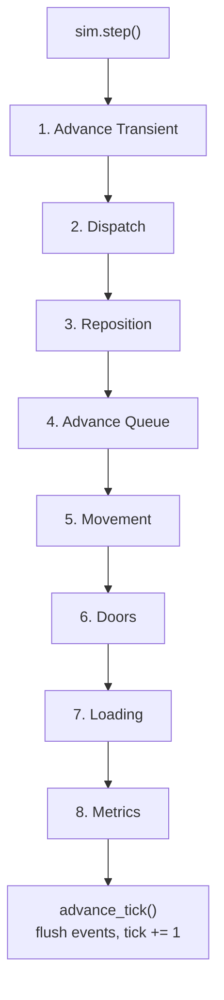

# The Simulation Loop

Each call to `sim.step()` runs one simulation tick. A tick consists of eight phases, always executed in the same order. Understanding this loop is essential for predicting when events fire, when state changes become visible, and where to inject custom logic.

## The 8-phase tick



Events emitted during a tick are buffered internally. After all eight phases complete, `advance_tick()` drains the buffer into the output queue, making events available to your code via `sim.drain_events()`.

## Phase 1: Advance Transient

Riders in one-tick transitional states are advanced to their next phase:

- `Boarding(elevator)` becomes `Riding(elevator)` -- the rider is now inside the car.
- `Exiting(elevator)` becomes `Arrived` (route complete) or `Waiting` (next route leg).
- Walk legs are executed immediately -- the rider is teleported to the walk destination.
- Patience is ticked for waiting riders. If a rider's patience expires, they transition to `Abandoned`.

This phase ensures that boarding and exiting -- set during Loading -- take effect at the start of the *next* tick, giving events a clean one-tick boundary.

**Events emitted:** `RiderAbandoned`

## Phase 2: Dispatch

The dispatch strategy examines demand and idle elevators, then decides where each car should go. This phase:

1. Builds a `DispatchManifest` from current rider state -- who is waiting where, who is riding to where.
2. Calls each group's `DispatchStrategy::rank()` for every idle/stopped elevator paired with every demanded stop.
3. Solves the optimal assignment so no two cars are sent to the same hall call.
4. Applies assignments: elevators transition to `MovingToStop(stop)`.
5. Updates direction indicators based on target position vs. current position.

If an elevator is already at its assigned stop, doors open immediately without a movement phase.

**Events emitted:** `ElevatorAssigned`, `ElevatorDeparted`, `DirectionIndicatorChanged`

See [Dispatch Strategies](dispatch-strategies.md) for details on built-in and custom strategies.

## Phase 3: Reposition

Optional phase for idle elevator coverage. Only runs if at least one group has a `RepositionStrategy` configured.

After dispatch, some elevators may still be `Idle` (no pending demand). The reposition strategy decides where to send them for better coverage -- spreading evenly across stops, returning to a lobby, or positioning near historically high-demand areas.

Repositioned elevators use `ElevatorPhase::Repositioning(stop)`, which is distinct from `MovingToStop(stop)`. On arrival, they go directly to `Idle` without a door cycle.

Groups without a registered strategy skip this phase entirely.

**Events emitted:** `ElevatorRepositioning`

## Phase 4: Advance Queue

Reconciles each elevator's current phase and target with the front of its `DestinationQueue`. This is where imperative pushes from game code take effect:

- `sim.push_destination(car, stop)` -- adds a stop to the back of the queue.
- `sim.push_destination_front(car, stop)` -- adds a stop to the front, redirecting the car.

An idle elevator with a non-empty queue transitions to `MovingToStop(front)`. An elevator already in transit is redirected if a `push_front` changed the queue head.

This phase is a no-op for games that never touch the queue -- dispatch keeps the queue and `target_stop` in sync on its own. Queue entries are consumed when a loading cycle completes at the target stop, so imperative and dispatch-driven itineraries compose naturally.

**Events emitted:** `ElevatorAssigned` (when a new target is adopted from the queue)

## Phase 5: Movement

Applies physics to all elevators in `MovingToStop` or `Repositioning` phase. The movement system uses a **trapezoidal velocity profile**: accelerate up to max speed, cruise, then decelerate to stop precisely at the target position.

Physics parameters (`max_speed`, `acceleration`, `deceleration`) are per-elevator, stored on the `Elevator` component.

The phase uses the `SortedStops` resource for O(log n) detection of stops passed during each tick. When an elevator passes a stop without stopping, a `PassingFloor` event fires -- useful for floor counter displays.

On arrival:
- Dispatched elevators (`MovingToStop`) transition to `DoorOpening` and doors begin opening. Emits `ElevatorArrived`.
- Repositioned elevators (`Repositioning`) go directly to `Idle` with no door cycle. Emits `ElevatorRepositioned`.

**Events emitted:** `ElevatorArrived`, `PassingFloor`, `ElevatorRepositioned`

## Phase 6: Doors

Ticks the door finite-state machine for each elevator:

```text
Closed -> Opening (transition_ticks) -> Open (open_ticks) -> Closing (transition_ticks) -> Closed
```

Phase transitions on completion:
- Finished opening: elevator transitions to `Loading` (riders can board/exit).
- Finished open hold: elevator transitions to `DoorClosing`.
- Finished closing: elevator transitions to `Stopped` (available for next dispatch).

Timing is per-elevator via `door_open_ticks` and `door_transition_ticks` in `ElevatorConfig`.

**Events emitted:** `DoorOpened`, `DoorClosed`

## Phase 7: Loading

Boards and exits riders at elevators in the `Loading` phase. Uses a two-pass approach:

1. **Read pass** -- scans all loading elevators and their stops, collecting actions (Exit, Board, or Reject).
2. **Write pass** -- mutates world state based on collected actions.

Rules:
- One rider action per elevator per tick (exit takes priority over boarding).
- Exiting: riders whose destination matches the current stop exit the elevator.
- Boarding: waiting riders enter, subject to weight capacity and direction indicators.
- Riders exceeding remaining capacity are rejected with a typed `RejectionReason`.

Direction indicators act as a boarding filter: a rider heading up will not board a car with `going_up = false`. The rider stays waiting -- no rejection event -- so a later car in the right direction picks them up.

**Events emitted:** `RiderBoarded`, `RiderExited`, `RiderRejected`

## Phase 8: Metrics

Reads events emitted during the current tick and updates aggregate metrics:
- Spawn count, board count, delivery count, abandonment count
- Wait time distribution (ticks between spawn and board, per rider)
- Ride time distribution (ticks between board and exit, per rider)
- Total distance traveled by all elevators

Also updates per-tag metric accumulators via `MetricTags`, enabling line-level and custom-tag breakdowns.

This phase is a read-only consumer -- it does not emit events.

## Hooks

Each phase supports before/after lifecycle hooks, letting you inject custom logic without sub-stepping:

```rust,ignore
sim.add_before_hook(Phase::Loading, |world| {
    // Custom logic before loading runs
});
```

See [Lifecycle Hooks](lifecycle-hooks.md) for the full hook API.

## Sub-stepping

For advanced use cases, you can run individual phases instead of calling `step()`:

```rust,no_run
# use elevator_core::prelude::*;
# use elevator_core::config::ElevatorConfig;
# use elevator_core::stop::StopId;
# fn main() -> Result<(), SimError> {
# let mut sim = SimulationBuilder::new()
#     .stop(StopId(0), "Ground", 0.0)
#     .stop(StopId(1), "Top", 10.0)
#     .elevator(ElevatorConfig::default())
#     .build()?;
sim.run_advance_transient();
sim.run_dispatch();
sim.run_reposition();
sim.run_movement();
sim.run_doors();
sim.run_loading();
sim.run_metrics();
sim.advance_tick(); // flush events and increment tick counter
# Ok(())
# }
```

This is equivalent to `sim.step()` but lets you inject logic between phases, skip phases, or run a phase multiple times. The phase methods can be called in any order, but the standard order exists for a reason -- deviating from it may produce unexpected results.

## Next steps

- [Dispatch Strategies](dispatch-strategies.md) -- what happens inside Phase 2
- [Lifecycle Hooks](lifecycle-hooks.md) -- injecting logic at phase boundaries
- [Events and Metrics](events-metrics.md) -- consuming the events each phase emits
