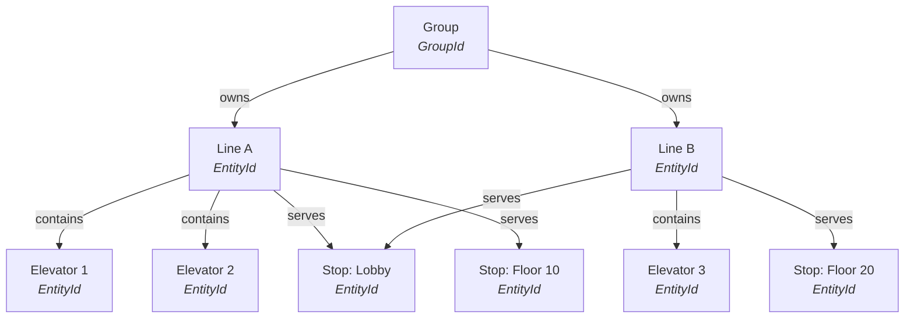

# Stops, Lines, and Groups

This chapter covers the spatial and organizational building blocks of an elevator-core simulation: where elevators travel, how shafts are modeled, and how cars are grouped for dispatch.

## Stops

A **stop** is a named position along a 1D shaft axis. Unlike traditional elevator simulators that assume uniform floor spacing, elevator-core places stops at arbitrary distances. A 5-story office might have stops at 0.0, 3.5, 7.0, 10.5, and 14.0. A space elevator might have stops at 0.0 and 35,786,000.0. The engine does not care -- the physics just scale.

```rust,no_run
# use elevator_core::prelude::*;
# use elevator_core::stop::StopId;
# use elevator_core::config::ElevatorConfig;
# fn main() -> Result<(), SimError> {
let sim = SimulationBuilder::new()
    .stop(StopId(0), "Basement", -3.0)
    .stop(StopId(1), "Lobby", 0.0)
    .stop(StopId(2), "Mezzanine", 2.5)
    .stop(StopId(3), "Floor 2", 6.0)
    .elevator(ElevatorConfig::default())
    .build()?;
# Ok(())
# }
```

Positions are plain `f64` values -- the library does not enforce meters, feet, or any other unit. Negative positions are fine (basements below a lobby at 0.0, for instance). There is no privileged zero or required origin.

## Lines

A **line** represents a physical path: a shaft, a tether, a track. Every elevator belongs to exactly one line, and a line defines which stops its elevators can reach.

For simple single-shaft buildings, you never need to think about lines. The builder auto-creates a default line that includes all stops and all elevators:

```rust,ignore
// This implicitly creates one line containing both elevators and all stops.
SimulationBuilder::new()
    .stop(StopId(0), "Ground", 0.0)
    .stop(StopId(1), "Top", 10.0)
    .elevator(ElevatorConfig { id: 0, ..Default::default() })
    .elevator(ElevatorConfig { id: 1, ..Default::default() })
    .build()?;
```

Lines matter when you have separate shafts serving different sets of stops -- a low-rise bank that only reaches floors 1-20 and a high-rise bank that serves 20-40, for example.

## Groups

A **group** is a dispatch unit: one or more lines that share a single dispatch strategy. The dispatch system evaluates demand and assigns elevators within each group independently.

The simplest simulations have one group (auto-created by the builder). Multi-group configurations are common in tall buildings where low-rise and high-rise banks operate independently, each with their own dispatch algorithm.

A stop can appear in multiple groups. A sky lobby served by both the low-rise and high-rise banks is a single stop entity referenced by lines in both groups.

## Entity relationships

The full hierarchy looks like this:



Key invariants:
- An elevator always belongs to exactly one line (`elevator.line` points to a `Line` entity)
- A line always belongs to exactly one group (`line.group` points to a `GroupId`)
- A stop may be shared across lines and groups
- Riders aboard an elevator appear in both `elevator.riders` and carry `RiderPhase::Riding(elevator_id)`

## Identity types

The library uses three identity types. Knowing which to reach for saves confusion:

| Type | Identifies | When you use it |
|---|---|---|
| `EntityId` | Any entity at runtime (stop, elevator, rider) | Event payloads, world lookups, dispatch decisions |
| `StopId` | A stop in the config (e.g., `StopId(0)`) | Builder API, config files, `spawn_rider` |
| `GroupId` | An elevator group (e.g., `GroupId(0)`) | Multi-group dispatch, group-specific hooks |

`StopId` is a config-level concept. When the simulation boots, each `StopId` is mapped to an `EntityId`. At runtime you work with `EntityId` everywhere. Convert when needed:

```rust,ignore
let lobby_entity: Option<EntityId> = sim.stop_entity(StopId(0));
```

## Coordinate system

- **Axis.** All positions are scalars along a single 1D axis. Higher values mean higher up (or further along for horizontal configurations). There is no 2D/3D geometry in the core.
- **Units.** Unspecified -- positions, velocities, accelerations, and weights are `f64` values. Keep them internally consistent. Convention: meters, kilograms, ticks.
- **Origin.** No privileged zero. Stop 0 does not have to be at position 0.0. Negative positions are allowed.

## Time

The fundamental unit of time is the **tick**. Each call to `sim.step()` advances the simulation by one tick.

Convert between ticks and seconds using the time API:

```rust,ignore
let seconds = sim.time().ticks_to_seconds(120);  // 120 ticks -> seconds
```

The conversion uses `ticks_per_second` from your config (default: 60). At 60 ticks/second, 120 ticks = 2.0 seconds.

## Next steps

- [Elevators](elevators.md) -- how elevator cars move through their phase lifecycle
- [Configuration](configuration.md) -- defining stops, lines, and groups in code or RON files
- [Dispatch Strategies](dispatch-strategies.md) -- how groups assign elevators to calls
